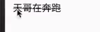

# TextView

### 文字简略

设定宽度，并让text超过宽度的部分显示为...

### 文字+icon

把icon图片放入drawable

下面-xxhdpi 表示不同的分辨率存不同图片

使用drawableRight 将icon图片放在text右侧

### 中划线 和下划线

需要在onCreate里对textview object 进行调

通过html去添加

### 跑马灯

